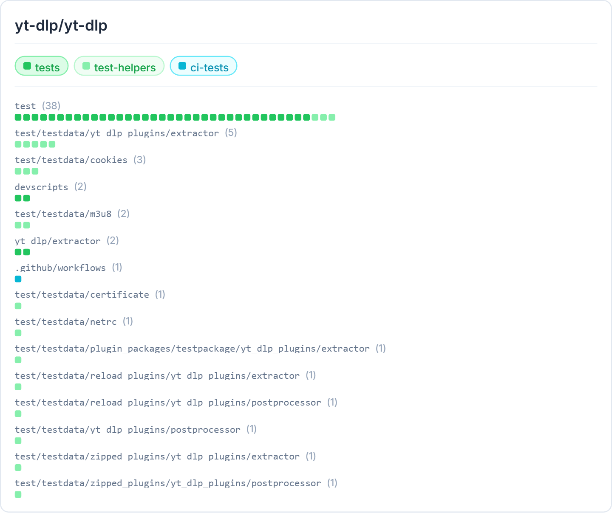

# Explorando Práticas de Teste

Neste exercício, vamos explorar práticas de teste em sistemas reais utilizando a ferramenta [TestMiner](https://andrehora.github.io/testminer).

O TestMiner permite visualizar e analisar testes de software em repositórios do GitHub, fornecendo dados sobre como os projetos organizam seus testes, como eles evoluem entre versões e quais bibliotecas de teste são utilizadas.
Explore a ferramenta antes de começar para se familiarizar com seu funcionamento.

---

## Passo 1: Selecionar um repositório

Escolha um repositório real que possua testes escritos na linguagem de sua preferência.
Abaixo estão alguns links para ajudá-lo a encontrar projetos interessantes:

- **Python:** https://github.com/topics/python?l=python
- **JavaScript:** https://github.com/topics/javascript?l=javascript
- **TypeScript:** https://github.com/topics/typescript?l=typescript
- **Java:** https://github.com/topics/java?l=java

## Passo 2: Explorar o repositório selecionado

Busque o repositório escolhido no [TestMiner](https://andrehora.github.io/testminer) e analise os dados de teste gerados pela ferramenta.

## Passo 3: Explicar uma prática de teste

Com base nos dados obtidos, selecione uma prática ou dado de teste relevante e explique-o com suas próprias palavras.

---

## Instruções de entrega

1. Faça um `fork` deste repositório (saiba mais sobre forks [aqui](https://docs.github.com/pt/pull-requests/collaborating-with-pull-requests/working-with-forks/fork-a-repo)).
2. Responda às questões abaixo diretamente neste arquivo `README.md` do seu fork. Pode adicionar imagens para enriquecer sua explicação.
3. No Moodle, submeta apenas a URL do seu fork.

---

## Respostas

**1. Repositório selecionado:** `<https://github.com/yt-dlp>`

---

**2. Explicação:**

## TestMiner

A análise no TestMiner mostra que o projeto possui diversos testes organizados por funcionalidade:



---

## Organização dos testes

Ao analisar o repositório yt-dlp utilizando a ferramenta TestMiner, é possível observar que os testes são organizados em três categorias principais:

- **Tests**: são os testes principais do sistema, responsáveis por verificar o comportamento das funcionalidades.  
- **Test Helpers**: são arquivos auxiliares que ajudam na criação dos testes, evitando repetição de código.  
- **CI Tests**: são testes utilizados em integração contínua, executados automaticamente para garantir que o sistema continue funcionando após alterações.  

---

## Estrutura dos testes

Os testes principais estão localizados na pasta:

```
test/
```

Dentro dessa pasta, os arquivos são organizados de acordo com funcionalidades específicas do sistema, os **Test Helpers** estão na pasta test/testdata, 
enquanto os **Tests** estão na pasta test/. Segue alguns exemplos de arquivos do tipo **Tests**: 

- `test_all_urls.py`
- `test_youtube.py`
- `test_networking.py`

Essa organização facilita a compreensão do código, pois os testes de integração e os testes unitários estão em uma mesma região, sendo que cada arquivo
do tipo .py já é uma modularização que ajuda a entender o comportamento do código.

---

## Análise do arquivo `test_all_urls.py`

O arquivo `test_all_urls.py` tem como objetivo verificar se diferentes URLs são corretamente reconhecidas pelos extractors do sistema.

### Estrutura geral

O arquivo segue o padrão da biblioteca `unittest` do Python, utilizando classes e métodos para organizar os testes.

### Exemplo de código

```python
class TestAllURLsMatching(unittest.TestCase):
    def setUp(self):
        self.ies = gen_extractors()

    def matching_ies(self, url):
        return [ie.IE_NAME for ie in self.ies if ie.suitable(url) and ie.IE_NAME != 'generic']
```

A classe `TestAllURLsMatching` agrupa diversos testes relacionados à validação de URLs.

O método `setUp` é uma fixture, ou seja, é executada antes de cada teste e inicializa os extractors que serão utilizados.

---

### Métodos de teste

Os testes são definidos como funções que começam com `test_`, como no exemplo abaixo:

```python
def test_youtube_user_matching(self):
    self.assertMatch('http://www.youtube.com/NASAgovVideo/videos', ['youtube:tab'])
```

Cada método de teste verifica um comportamento específico do sistema. Isso segue o princípio de testes pequenos e focados, facilitando a identificação de erros.

---

### Organização interna dos testes

O arquivo contém diversos métodos de teste, como:

- `test_youtube_playlist_matching`
- `test_youtube_matching`
- `test_youtube_channel_matching`
- `test_youtube_user_matching`

- `test_facebook_matching`

- `test_vimeo_matching`


Cada um deles testa um tipo específico de URL ou comportamento, mostrando uma divisão de responsabilidades.

---

## Conclusão

A organização dos testes no projeto yt-dlp segue boas práticas de software, com separação clara entre testes principais, auxiliares e de integração contínua. Além disso, a estrutura dos testes baseada em classes e métodos permite que cada comportamento seja testado de forma isolada, facilitando a manutenção e legibilidade do sistema.


